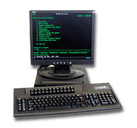
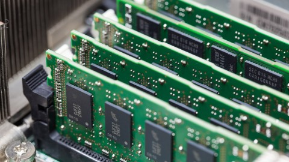
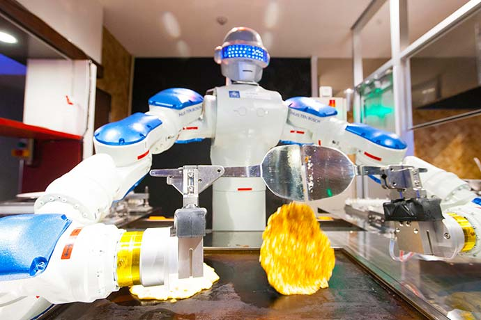

@title[Computers and the CLI]
## Computers and the CLI 

#### Interacting with operating systems 

Who needs a mouse when we have *keys*!

[comment]: # (slides are about 54 characters wide in simple)  

---
@title[Introduction]
@transition[none]
@snap[north-west]
<h4>Introduction Exercise</h4> 
@snapend 

To begin, double-click a web browser icon...  <!-- .element: class="fragment" -->

with your mouse <!-- .element: class="fragment" -->


+++?image=null.jpg&color=orange
@title[Exercise:  GUI recipe]
@transition[none]
@snap[north-west]
<h4>Exercise:  GUI recipe</h4> 
@snapend 

With your mouse, open a web browser

- Safari
- Firefox
- Chrome
- Edge 

[comment]: # (-----------------------EXERCISE--------------------------------) 


---?image=null.jpg&color=green
@title[Introduction - Learning Objectives]
@transition[none]
@snap[north]
<h3>Learning Objectives</h3> 
@snapend 

- Understand how computers represent information |
- Understand how to interact with the computer using commands |
- Understand how to organize your digital work in directories |

@fa[arrow-right]


[comment]: # (-----------------------LEARNING OBJECTIVES-------------------------) 


---?image=null.jpg&color=orange
@title[Introduction - Assumptions]
@transition[none]
@snap[north]
<h3>Assumptions</h3> 
@snapend 

- Laptop computer with Internet access 
- Familiarity with GUIs @size[0.8em]([Windows, Mac OS]) 
- Terminal emulator program installed 
  - Terminal on Mac OS 
  - GitBash on Windows 
- Git program installed @size[0.8em]([by default on most Macs, comes with GitBash for Windows]) 


[comment]: # (-----------------------ASSUMPTIONS--------------------------------) 


  
---?image=null.jpg&color=green
@title[Introduction - Interfaces]
@transition[none]
@snap[north]
<h3>Interfaces</h3> 
@snapend 

| ***GUI*** <br/>  _graphical user interface_ | ***CLI*** <br/> _command-line interface_  |
|                         --- |                      --- |
| @size[0.8em]("windows" of work)           | @size[0.8em]("lines" of work)          | 
| @size[0.8em](mouse input)                 | @size[0.8em](keyboard input)           | 
| @size[0.8em](user-friendly & wide-angle)  | @size[0.8em](efficient & myopic)       | 


---
@title[Computer Introduction]
@transition[none]
### Computer Introduction
<br/>
#### How computers represent information, 

#### take orders, 

#### and follow them  
<br/>

@snap[south]
@fa[arrow-right]
@snapend

[comment]: # (section title - components, features, IO) 


---
@title[Computer Intro - Orders] 
### Computer Introduction 

#### How computers represent information

@fa[arrow-down]

@snap[south]
@size[0.7em](skip intro section @fa[arrow-right])
@snapend

+++?image=assets/001_hw_sw.jpg&size=70% auto
@title[Computer Intro - Components]
@transition[none]

@snap[north-west]
<h4>Computer Intro - Components</h4> 

Computers have: 
@snapend 

+++
@title[Computer Intro - Features]
@transition[none]
@snap[north-west]
<h4>Computer Features - Input/Output</h4> 
@snapend 

Computers receive **input** & produce **output**



+++
@title[Computer Intro - Purpose]
@transition[none]
@snap[north-west]
<h4>Computer Purpose - information processing</h4> 
@snapend 

Computers are built to help _process information_.  
<br/>
<span class="fragment">They only "dish out" what we _instruct_ them to. </span>

@snap[south]
@fa[arrow-down]
@snapend

+++
@title[Computer Intro - Abilities]
@transition[none]
@snap[north-west]
<h4>Computer Abilities</h4> 
@snapend 

Computers: 
<br/>
- accept instructions |
- store & access information |
- perform calculations & tasks |
<br/>

_That's it._  <!-- .element: class="fragment" -->

+++
@title[Computer Intro - Information] 
@transition[none]
@snap[north-west]
<h4>How computers represent information</h4> 
@snapend 

To a computer, all information is either:
<br/>
- <span class="fragment">a **file** (stored data, static) </span>
- <span class="fragment">a **process** (active instructions, dynamic) </span>


Note:
"Folders" are also files 


+++?image=assets/003_hd_orig.jpg&size=auto
@title[Computer Intro - Files]
@transition[none]
@snap[north-west]
<h4>How computers represent information</h4> 
@snapend 

**Files (like recipes) live in non-volatile storage, like hard discs**


@snap[south]
@fa[arrow-down]
@snapend

+++
@title[Comuter Intro - Proceses]
@transition[none]
@snap[north-west]
<h4>How computers represent information</h4> 
@snapend 

Unlike disc data,

- **Processes** (like our browser window) live in volatile storage like RAM



@snap[south]
@fa[arrow-down]
@snapend

+++
@title[Computer Intro - HD & RAM]
@transition[none]
@snap[north-west]
<h4>Computer Intro - HD & RAM</h4> 
@snapend 

#### How computers represent information 

<table>
  <tr><td></td>
      <td></td>
  </tr>
  <tr><td>
        <ul><li>@size[0.8em](stored data)</li> 
          <li>@size[0.8em]("long-term" memory)</li> 
          <li>@size[0.8em](persist through power loss)</li> 
        </ul>
      </td>
      <td>
        <ul><li>@size[0.8em](active instructions)</li> 
          <li>@size[0.8em]("short-term" memory)</li> 
          <li>@size[0.8em](only exist while the computer is on)</li> 
        </ul>
      </td>
  </tr>
</table> 

@snap[south]
@size[0.7em](onto taking orders @fa[arrow-right])
@snapend


---
@title[Computer Intro - Orders] 
### Computer Introduction 

#### How computers take orders 

@fa[arrow-down]

@snap[south]
@size[0.7em](skip intro section @fa[arrow-right])
@snapend


[comment]: # (section title - files & processes) 


+++
@title[Computer Intro - Input/Output] 
@transition[none]
@snap[north-west]
<h4>How computers take orders - input</h4> 
@snapend 

### Process Input & Output

- <span class="fragment">**Files** just sit there </span>

<br/>
- <span class="fragment">**Processes** do all the work:</span>
  - "follow orders" <!-- .element: class="fragment" -->
  - <span class="fragment">accept _input_ </span>
  - <span class="fragment">provide _output_ </span> 


+++
@title[Computer Intro -- Input]
@transition[none]
@snap[north-west]
<h4>How computers take orders - live, stored</h4> 
@snapend 

Input can be: 

- <span class="fragment">"stuff we're typing right now" (**live** stream) </span>
  - @size[0.8em](hailing a waiter, making an order) <!-- .element: class="fragment" -->
  
<br/>
- <span class="fragment">"stuff we typed a while ago" (a **stored** file) </span>
  - @size[0.8em](reading recipe steps)  <!-- .element: class="fragment" -->


+++?image=null.jpg&color=orange
@title[Exercise review:  live & stored input]
@transition[none]
@snap[north-west]
<h4>Exercise review:  live & stored input</h4> 
@snapend 

- <span class="fragment">mouse to a shortcut icon & click it @size[0.8em]([live]) </span>
- <span class="fragment">activate a browser program @size[0.8em]([stored]) </span>
- <span class="fragment">launch a web browser process @size[0.8em]([live]) </span>

<br/>
@fa[arrow-down]


+++?image=null.jpg&color=orange
@title[Orders:  Behind the scenes -- GUI]
@transition[none]
@snap[north-west]
<h3>Orders:  Behind the scenes (GUI)</h3> 
@snapend 

- "Open a web browser"
  - <span class="fragment">Navigation (IO mouse):  @size[0.8em](mouse to icon) </span>
  - <span class="fragment">Order (input):  @size[0.8em](mouse click) </span>
  - <span class="fragment">Recipe (IO process):  @size[0.8em](web browser program) </span>
  - <span class="fragment">Dish (output screen):  @size[0.8em](web browser page) </span>

[comment]: # (-----------------------EXERCISE--------------------------------) 


+++
@title[Computer Intro -- IO streams]
@transition[none]
@snap[north-west]
<h4>How computers represent information - IO streams</h4> 
@snapend 

### Input & Output streams 

- Each **process** (mouse & browser) has 3 streams of information:  

**input**, **output**, & **error** (a special type of output) 


[comment]: # (section title - IO & commands) 


Note:
Each program can handle errors differently.  


+++?image=null.jpg&color=green
@title[Definitions:  Process IO streams]
@transition[none]
@snap[north-west]
<h4>Definitions:  Process IO streams</h4> 
@snapend 

- **stdin** 
  - @size[0.8em](standard **input** data stream)
- **stdout** 
  - @size[0.8em](standard **output** data stream)
  - @size[0.8em](for results) 
- **stderr** 
  - @size[0.8em](standard **error** data stream)
  - @size[0.8em](for warnings & diagnostic messages)


Note:
Though these are Unix streams, the concepts are present in most systems.  

[comment]: # (-----------------------DEFINITIONS------------------------------) 


     
  
  
+++
@title[Computer Intro - Commands]
@transition[none]
@snap[north-west]
<h4>How computers take orders - commands</h4> 
@snapend

How did we really tell the computer to <br/>
_process_ our inputs? 

<br/>
- <span class="fragment">with special directives called **commands** </span>

<br/>
<span class="fragment">**commands** are like "orders" for a computer </span>

@snap[south]
@size[0.7em](onto following orders @fa[arrow-right])
@snapend


[comment]: # (section title - IO & commands) 


---
@title[Computer Intro - programs, software] 
### Computer Introduction 

#### How computers follow orders 

@fa[arrow-down]

@snap[south]
@size[0.7em](skip intro section @fa[arrow-right])
@snapend


[comment]: # (section title - programs & software) 


+++ 
@title[Computer Intro - Programs]
@transition[none]
@snap[north-west]
<h4>How computers process information - programs</h4> 
@snapend

How does the computer _process_ our information? 

<br/>
- <span class="fragment">by following _special instructions_ called **programs** </span>
  
<br/>
<span class="fragment">**programs** are like "recipes" for a computer </span>


+++?image=null.jpg&color=orange
@title[Exercise:  another GUI order]
@transition[none]
@snap[north-west]
<h4>Exercise: another GUI order</h4> 
@snapend

[https://github.com/ccs-training/linux-for-research](https://github.com/ccs-training/linux-for-research)

- (open a new tab) 
- visit seminar GitHub
- look at some files 
- (log in, if you have an account)

@fa[arrow-down]

[comment]: # (-----------------------EXERCISE--------------------------------) 


+++?image=null.jpg&color=orange
@title[More Orders:  Behind the scenes]
@transition[none]
@snap[north-west]
<h4>More Orders:  Behind the scenes</h4> 
@snapend

- "Visit a website & log in" 
  - Navigation (IO):  @size[0.8em](mouse to address bar & login fields) |
  - Orders (input):  @size[0.8em](keyboard input & mouse clicks) |
  - Recipes (IO):  @size[0.8em](browser program, send & receive text) |
  - Dish (output):  @size[0.8em](display website, display login results) |

  
+++
@title[Following Orders]
@transition[none]
@snap[north-west]
<h4>Following Orders</h4> 
@snapend

Computers follow orders _sequentially_ <br/>
@size[0.8em]([for the most part]).  

<br/>
They also share resources.  

<br/>
- first recipe ordered, first _started_ 
  - @size[0.8em](may not finish first) 
  
<br/> 
- last ordered, last started 
  - @size[0.8em](may finish quickly, if no other recipes going) 

  
  
+++
@title[Robot Kitchens to the rescue]
@transition[none]
@snap[north-west]
<h4>How computers follow orders - Robot Kitchens</h4> 
@snapend

How do "orders" & "recipes" help us _understand_ computers?

<br/>
<br/>

@size[1.5em](Let's dig in with a metaphor!)

@fa[arrow-right]


---?image=assets/006_kitchen.jpg&size=70% auto
@title[Robot Kitchens]
@transition[none]

# @color[navy](**Robot Kitchens**)

## @color[maroon](<b>How computers<br/>follow orders</b>)


@color[maroon](@fa[arrow-down])

@snap[south]
@size[0.7em](skip metaphor @fa[arrow-right])
@snapend

[comment]: # (section title - Robot Kitchen metaphor) 


+++?image=assets/007_kitchen_pantry.jpg&size=70% auto
@title[Robot Kitchen]
@transition[none]
@snap[north-west]
@color[navy](<h3><b>Robot Kitchen</b></h3>) 
@snapend

**Computers are like commercial kitchens:**
<br/>
- **full of machinery & instructions** 
- **need "guidance"** (staff, recipes, orders)

@fa[arrow-down]


+++?image=assets/008_kitchen_staff.jpg&size=50% auto 
@title[Robot Kitchen]
@transition[none]
@snap[north-west]
<h4>Robot Kitchen</h4> 
@snapend

What do commercial kitchens & staff do?
<br/>
<br/>
<br/>
## @color[navy](**fill "orders"**)
<br/>
<br/>
<br/>
- facilitate food processing & service 

+++
@title[Robot Kitchen]
@transition[none]
@snap[north-west]
<h4>Robot Kitchen</h4> 
@snapend

How do Robot Kitchens fill orders?  In these 2 ways: 
<br/>

- <span class="fragment">_store_ ingredients & "recipes" </span>
- <span class="fragment">_follow_ recipes </span>

<br/>
<br/>
This should be familiar... <!-- .element: class="fragment" -->

+++
@title[Kitchens & Computers - Kitchens]
@transition[none]
@snap[north-west]
<h4>Kitchens & Computers</h4> 
@snapend

| ***Robot Kitchens***                            | ***Computers***                                                 |
|                         --- |                      --- |
| @size[0.8em](_take_ **orders**)                 | @size[0.8em](_accept_ **commands**)                             | 
| @size[0.8em](_store_ ingredients & **recipes**) | @size[0.8em](_store_ & access data <br/> [including **programs**])    | 
| @size[0.8em](_follow_ recipes)                  | @size[0.8em](_perform_ calculations & tasks <br/> [run programs])     | 


@fa[arrow-down]  


[comment]: # (https://www.youtube.com/watch?v=dbIEamupKLw)


Note:
Dubstep Dispute:  https://www.youtube.com/watch?v=dbIEamupKLw

  

+++
@title[Kitchens & Computers -- hardware]
@transition[none]
@snap[north-west]
<h4>Kitchens & Computers -- equipment</h4> 
@snapend

Like kitchen equipment, computer equipment: 
<br/>
- only does what **ordered** to do 
- by following special instructions 

@fa[arrow-down]

@snap[south]
@size[0.7em](skip more metaphor @fa[arrow-right])
@snapend


+++
@title[Kitchens & Computers -- software]
@transition[none]
@snap[north-west]
<h4>Kitchens & Computers -- instructions</h4> 
@snapend

Special files called **program files** contain these instructions for the computer:


For example, a stand mixer... @fa[arrow-down]

+++?image=assets/010_stand_mixer.jpg&size=70% auto
@title[Robot Kitchen Equipment]
@transition[none]
@snap[north-west]
<h4><b>Robot Kitchen Equipment</b></h4> 
@snapend

## **Robot Kitchen's <br/> Stand Mixer**

+++?image=assets/010_stand_mixer.jpg&size=70% auto
@title[Robot Kitchen Equipment]
@transition[none]
@snap[north-west]
<h4><b>Robot Kitchen Equipment</b></h4> 
@snapend

**Until a robot chef pushes** <br/>
**some buttons,** <br/>
***equipment doesn't do anything.***
<br/>
<br/>
> **If Robot Chef pushes** <br/>
> ***the wrong buttons,*** <br/> 
> **the mixer might ruin your order.**


+++
@title[Robot Kitchen Staff]
@transition[none]
@snap[north-west]
<h4>Robot Kitchen Staff</h4> 
@snapend

In Robot Kitchen, staff includes: 
<br/>
- Waiters to take orders 
  <span class="fragment"> </span>
- Demi-chefs to use equipment & ingredients 
  <span class="fragment"> </span>
- Head Chef to oversee demi-chefs & kitchen
  <span class="fragment"> </span>


---
@title[How computers follow recipes]
@transition[none]
@snap[north-west]
<h4>How computers follow recipes</h4> 
@snapend

In general, recipes can be:
<br/>

- live or stored @size[0.8em]([mouse, file])
- yours or someone else's @size[0.8em]([...file, mouse])
- direct or indirect @size[0.8em]([chef language, waiter language])

@fa[arrow-down]

@snap[south]
@size[0.7em](skip recipes @fa[arrow-right])
@snapend

[comment]: # (section title - types of recipes) 


+++?image=null.jpg&color=orange
@title[Exercise:  recipes & processes]
@transition[none]
@snap[north-west]
<h4>Exercise:  recipes & processes</h4> 
@snapend

| in GitHub repo online, |  use your @size[0.8em]([active]) **mouse** _process_ | look at @size[0.8em]([stored]) **pie.sh** _recipe_ |
| :---      | ---                    | ---                                    |
| format:   | live @size[0.8em]([user input, active instructions]) | stored @size[0.8em]([file on disc]) |
| language: | your OS suite @size[0.8em]([likely C])               | Bash @size[0.8em]([sh])             |
| type:     | compiled                    | interpreted                            |


[comment]: # (-----------------------EXERCISE--------------------------------) 


+++
@title[Recipes -- interpreted vs. compiled]
@transition[none]
@snap[north-west]
<h4>Interpreted vs. Compiled</h4> 
@snapend

| Direct (_compiled_):  <br/> @size[0.8em](recipes like your web browser)| Indirect (_interpreted_):  <br/> @size[0.8em](recipes like shell scripts) | 
| --- | --- | 
| @size[0.8em](staff doesn't have an interpreter) | @size[0.8em](staff has an interpreter) | 
| @size[0.8em](all intsructions translated into machine language _first_) | @size[0.8em](each instruction converted into machine language **live**) |
 

@fa[arrow-down] 


+++
@title[Recipes -- interpreted vs. compiled]
@transition[none]
@snap[north-west]
<h4>Interpreted vs. Compiled</h4> 
@snapend

| Direct (_compiled_):  <br/> @size[0.8em](recipes like your web browser)| Indirect (_interpreted_):  <br/> @size[0.8em](recipes like shell scripts) | 
| --- | --- | 
| @size[0.7em](two files:  <br/> 'source code' [our recipe] <br/> 'compiled code' [computer's recipe]) | @size[0.8em](only 1 file:  source code)    |
| @size[0.8em](the **program file** is in machine language [binary])  | @size[0.8em](the **program file** is in human-readable laguage) | 
 

@fa[arrow-right]
 

---?image=assets/014_gui_search.jpg&size=70% auto
@title[How computers take orders - CLI]
@transition[none]
@snap[north-west]
<h4><i>CLI - what does this all mean?</i></h4> 
@snapend

#### Everything we can do graphically, 

### **we can _also_ do with the _keyboard_**.

- launch programs (web browser, MS Excel) |
- manage processes |
- manage access permissions |
- manage documents (browse, move, rename) |
- search for documents |
- manipulate text in (text) documents |

@fa[arrow-down]

@snap[south]
@size[0.7em](skip CLI @fa[arrow-right])
@snapend


+++?image=null.jpg&color=orange
@title[Exercise:  hail a robot waiter]
@transition[none]
@snap[north-west]
<h4>Exercise:  hail a robot waiter</h4> 
@snapend

- launch Terminal or GitBash 
- look at the shell's _interactive_ prompt 

Terminal:
```
[username @ hostname ~]$ 
```

GitBash:
```
username @ hostname platform ~
$
```

[comment]: # (-----------------------EXERCISE--------------------------------) 


+++
@title[Orders -- interactive]
@transition[none]
@snap[north-west]
<h4>Interactive Robot Waiters</h4> 
@snapend

**Interactive** shells "wait" for your keyboard input.

Interactive prompts typically show:
<br/>

- who you are (**username**) 
- what kitchen you're at (**hostname** or computer) 
- where you're looking in the pantry (**directory** or path) 


Note:
Waiter Bash doesn't have "windows" for navigation.
We'll need to make orders _without a mouse_ - using **commands**
 
  


+++?image=null.jpg&color=orange
@title[Exercise:  order appetizers]
@transition[none]
@snap[north-west]
<h4>Exercise:  order appetizers</h4> 
@snapend

- send some **commands** to the shell: 
  - <span class="fragment">`who` is logged in </span>
  - <span class="fragment">`ps` _what_ else this Waiter is doing </span>
  - <span class="fragment">`pwd` _where_ you are in the kitchen pantry </span>
  - <span class="fragment">`ls` _list_ other items on this shelf </span>

@fa[arrow-down]


+++?image=null.jpg&color=orange
@title[Exercise:  check IO streams -- echo]
@transition[none]
@snap[north-west]
<h4>Exercise:  check IO streams -- echo</h4> 
@snapend

```
$ echo hello
hello

$ echo have input, get output?
have input, get output?
```

Note:
Shell built-in, use `help echo` for instructions in GitBash (`man echo` in Terminal)

[comment]: # (-----------------------EXERCISE--------------------------------) 


---?image=null.jpg&color=green
@title[Navigation Commands]
@transition[none]
@snap[north-west]
<h3>Navigation Commands</h3> 
@snapend

- `pwd` -- print working directory
  - @size[0.8em](_where_ we are in the pantry [which shelf]) 
- `ls` -- list directory contents (`ls -l` @size[0.8em](long format))
  - @size[0.8em](_what_ items are on a shelf])
- `cd` -- change directory (`cd ~` @size[0.8em](to go home)) 
  - @size[0.8em](_go to_ another shelf in the pantry) 
- `history` -- output shell command history to screen
  - @size[0.8em](use keyboard arrows to browse history from the prompt) 

Note:
Programs usually come with an instruction manual. 
Most shell program manuals can be accessed with:

`man command` in Terminal

`command --help` in GitBash 

or `help command` for GitBash built-in commands like `echo`

[comment]: # (-----------------------DEFINITIONS------------------------------) 


---
@title[Orders -- keyboard & CLI ]
@transition[none]
@snap[north-west]
<h3>Using the keyboard -- CLI</h3> 
@snapend

- **What have we been doing?** 
  - ordering items from a menu |
  
  
<br/>
- <span class="fragment">**What has _the computer_ been doing?**</span>
  - finding recipes in our kitchen |
  - processing our orders <!-- .element: class="fragment" -->

@fa[arrow-down]
  
@snap[south]
@size[0.7em](skip more metaphor @fa[arrow-right])
@snapend


+++
@title[Computers & Robot Kitchen]
@transition[none]
@snap[north-west]
<h3>Computers & Robot Kitchen</h3> 
@snapend

In computer systems,

<br/>
- **Programs** are like recipes for Robot Kitchen
- **Operating Systems** are like chefs & kitchen staff
- **Processes** are the recipes our chefs are making

@fa[arrow-down]


---?image=null.jpg&color=green
@title[Definitions:  Computer Systems]
@transition[none]
@snap[north-west]
<h4>Definitions:  Computer Systems</h4> 
@snapend 

- **Program** -- @size[0.8em](set of instructions for a computer to follow)
- **Operating System** -- @size[0.8em](programs that work together to manage computer resources)

- **File** -- @size[0.8em](stored information [can be a program])
- **Process** -- @size[0.8em](active program)

- ***Program File*** -- @size[0.8em](_special file with instructions for a computer_)


[comment]: # (-----------------------DEFINITIONS------------------------------) 


---
@title[Orders - Computer Staff]
@transition[none]
@snap[north-west]
<h4>Computer system resources & staff</h4> 
@snapend 

**Why must we staff computers & kitchens, anyway?** 

- Equipment may be shared |
- Instructions may be in shorthand |
- Others may be placing orders |

<br/>
<span class="fragment">Like the browser recipe from earlier, <br/>
and the shell window. </span>

@fa[arrow-right]


---?image=null.jpg&color=orange
@title[Exercise:  Internet sonar -- ping]
@transition[none]
@snap[north-west]
<h4>Exercise:  Internet sonar</h4> 
@snapend

```
$ ping nih.gov
Pinging nih.gov [54.235.145.223] with 32 bytes of data:
Reply from 54.235.145.223: bytes=32 time=35ms TTL=44
...
    Minimum = 35ms, Maximum = 36ms, Average = 35ms
Control-C
```

- `CTRL-C` (Windows & Linux) or `CMD-C` (Mac) to quit active process 
- in **interactive** shells, output goes to the screen or terminal window  

Note:
`ping` is a bit like Internet sonar -- useful to check if you can reach web hosts 

[comment]: # (-----------------------EXERCISE--------------------------------) 


  

 

---?image=null.jpg&color=green
@title[Definitions:  Process IO streams]
@transition[none]
@snap[north-west]
<h4>Definitions:  Process IO streams</h4> 
@snapend 

- **stdin** -- standard **input** data stream, for processes  
  - @size[0.8em](keyboard, for interactive Bash Shells) 
- **stdout** -- standard **output** data stream, for results 
  - @size[0.8em](screen or terminal window [interactive]) 
- **stderr** -- standard **error** data stream, for warnings & diagnostic messages
  - @size[0.8em](also screen or terminal window [interactive]) 

Note:
We'll learn how to redirect these streams later.  

[comment]: # (-----------------------DEFINITIONS------------------------------) 


---
@title[Processing information - Computer staff]
@transition[none]
@snap[north-west]
<h4>Processing information - Computer staff</h4> 
@snapend 

What keeps track of commands & process information?

Computer staff! 

@snap[south]
@size[0.7em](skip staff metaphor @fa[arrow-right])
@snapend


+++
@title[Computer Staff]
@transition[none]
@snap[north-west]
<h4>Computer staff</h4> 
@snapend 

### Computer staff monitor: 

<br/>
- web browser & tabs 
- Terminal emulator & commands 
- any Office programs you may have open 

@fa[arrow-down]

+++
@title[Computer Staff]
@transition[none]
@snap[north-west]
<h4>Computer staff</h4> 
@snapend 

### Computer staff know about: 

<br/>
- your recipes 
- kitchen equipment being used 
- _time spent_ on that equipment 


+++
@title[Computer staff]
@transition[none]
@snap[north-west]
<h4>Computer Staff</h4> 
@snapend

### When we place an order, staff:

<br/>
- check the menu
- find recipes
- follow them (make our orders)


---?image=null.jpg&color=orange
@title[Exercise:  time an order)]
@transition[none]
@snap[north-west]
<h4>Exercise:  use staff to time an order</h4> 
@snapend

- examine _real_, _user_ (CPU), and _sys_ (CPU) time values:

```
[username @ hostname ~]$ time ping nih.gov
Pinging nih.gov [54.235.145.223] with 32 bytes of data:
Reply from 54.235.145.223: bytes=32 time=35ms TTL=44
^C
..
real    0m2.359s
user    0m0.001s
sys     0m0.005s
```

- `time` can be used to compare program performances.
- `CTRL-C` or `CMD-C` to quit active process

@fa[arrow-down]


+++?image=null.jpg&color=orange
@title[Exercise:  time an order)]
@transition[none]
@snap[north-west]
<h4>Exercise:  order times</h4> 
@snapend


<br/> 
- **real time:**  @size[0.8em](clock seconds) 
- **user time:**  @size[0.8em](amount of time **you** spent on the CPU) 
- **sys time:**   @size[0.8em](amount of time **the kernel** spent on the CPU _for you_) 

<br/>
Add ***user*** & ***sys*** time to get total CPU time. 

[comment]: # (-----------------------EXERCISE--------------------------------) 


---
@title[Operating Systems -- Computer staff personnel]
@transition[none]
@snap[north-west]
<h4>Operating Systems -- Computer staff personnel</h4> 
@snapend

<br/>
- Waiter **Shells** take orders
- **System Programs** use equipment & ingredients
- Chef **Kernel** oversees programs & kitchen use

<br/>
Definitions:  @fa[arrow-down]

@snap[south]
@size[0.7em](skip definitions @fa[arrow-right])
@snapend

+++?image=null.jpg&color=green
@transition[none]
@title[Operating System components -- Kernel]
@snap[north-west]
<h4>Operating System components -- Kernel</h4> 
@snapend

**Kernel**

<br/>
- core component of an operating system
- responsible for resource management & program execution

@fa[arrow-down]

  
+++?image=null.jpg&color=green
@title[Operating System components -- Shell]
@transition[none]
@snap[north-west]
<h4>Operating System components -- Shell</h4> 
@snapend
  
**Shell**

<br/>
- interfaces with the **kernel**
- interprets user commands

@fa[arrow-down]


+++?image=null.jpg&color=green
@title[Operating System components -- System Programs]
@transition[none]
@snap[north-west]
<h4>Operating System components -- System Programs</h4> 
@snapend

**System Programs**

<br/>
- implement most OS functions, like: 
  - input devices |
  - user environments |
  - schedulers |

[comment]: # (-----------------------DEFINITIONS------------------------------) 


---
@title[Computer Kitchens]
@transition[none]
@snap[north-west]
<h4>Computer Kitchens</h4> 
@snapend

#### During kitchen prep, staff:
- check the pantry <!-- .element: class="fragment" -->
- read recipes <!-- .element: class="fragment" -->
- follow instructions <!-- .element: class="fragment" -->

<br/>
#### Once the kitchen opens, staff: <!-- .element: class="fragment" -->
- take & process orders <!-- .element: class="fragment" -->

<br/>
@snap[south]
@size[0.7em](skip OS components @fa[arrow-right])
@snapend

+++
@title[Computer Kitchens -- Kernel]
@transition[none]
@snap[north-west]
<h4>Computer Kitchens - kernel</h4> 
@snapend

### Chef Kernel 

#### (the manager)  

- knows the equipment in our kitchen (from mixing bowls to stove tops) and how to use it 
- speaks low-level languages like machine code (binary) and assembly (symbolic binary) 
- does not speak high-level languages (requires an interpreter) 

@fa[arrow-down]


+++
@title[Computer Kitchens -- Shells]
@transition[none]
@snap[north-west]
<h4>Computer Kitchens - shells</h4> 
@snapend

### Waiter Shells 

#### (the interpreters)

- check that your items are on the Robot Kitchen menu 
- tell Chef Kernel about your order 
- speak some high-level languages 
- speak enough assembly to interpret for Chef Kernel 

@fa[arrow-down]


+++ 
@title[Computer Kitchens -- System Programs]
@transition[none]
@snap[north-west]
<h4>Computer Kitchens - system programs</h4> 
@snapend

### Demi-chefs 

#### (the system helpers)  

- receive tasks from Chef Kernel 
- use kitchen equipment 
- sort the pantry ingredients 


+++
@title[How computers take & follow orders -- OS]
@transition[none]
@snap[north-west]
<h4>How computers take & follow orders - Operating Systems</h4> 
@snapend

<br/>
When you order from the **shell**, <br/>
the **kernel** delegates some work to <br/>
the saucier & patissier demi-chefs.


@snap[south]
@size[0.7em](onto more orders @fa[arrow-right])
@snapend

  

---?image=null.jpg&color=orange
@title[Exercise:  date appetizer]
@transition[none]
@snap[north-west]
<h4>Exercise:  date appetizer</h4> 
@snapend


```
[username @ hostname ~]$ date
Wed Mar 14 11:50:33 EDT 2018
```
- the `date` **command** tells Bash our order 
- Bash finds & executes the _program file_ for `date`  
- the **process** outputs information (to the screen for interactive shells) 
  
By default, date shows your computer's current timezone. 
  
@fa[arrow-down]


+++?image=null.jpg&color=orange
@title[Exercise:  order modifications]
@transition[none]
@snap[north-west]
<h4>Exercise:  order modifications</h4> 
@snapend

```
[username @ hostname ~]$ date -u
Wed Mar 14 08:50:33 UTC 2018
```

- the `-u` **parameter** tells Bash we want the date it UTC format, Universal time


Note:
Space between **command** `date` and **flag** `-u` (no space between dash & u)

Many commands can be customised
Use `date --help` to review command parameters


---?image=null.jpg&color=orange
@title[Exercise:  command --help & manuals]
@transition[none]
@snap[north-west]
<h4>Exercise:  command `--help` & manuals</h4> 
@snapend

```
[username @ hostname ~]$ date --help
```
- `date --help` for GitBash (Windows) 
- `man date` for Linux & Mac "manual pages" 
- `q` to quit pagers 

<br/>
@size[0.8em](Details @fa[arrow-down])


+++
@title[Command --help & manuals]
@transition[none]
@snap[north-west]
<h4>Command `--help` & manuals</h4>
@snapend

To mimic `man` in GitBash, pipe output to a pager:  
```
date --help | less
```

- `q` to quit pagers
- @size[0.8em](more on piping & paging later)
 


[comment]: # (-----------------------EXERCISE--------------------------------) 


---?image=null.jpg&color=green
@title[Command --help & manuals]
@transition[none]
@snap[north-west]
<h4>Command `--help` & manuals</h4>
@snapend

- `man <command>` @size[0.8em](in Terminal)
  - Linux & Mac `man` pages output through a pager 
  - `q` to quit pagers 
- `<command> --help` @size[0.8em](in GitBash) 
  - `--help` prints brief command info directly to screen
- or `help <command>` for GitBash built-in commands like:
  - `echo` 
  - `time` 
  - `help` 


---?image=null.jpg&color=green
@title[Command Anatomy]
@transition[none]
@snap[north-west]
<h4>Command anatomy</h4> 
@snapend

> command -parameter(s) argument(s)

- **Argument** 
  - @size[0.8em](input passed to the command)
  - @size[0.8em](often the target of the command)
- **Parameter**
  - @size[0.8em](term that modifies what the command does)
  - @size[0.8em](also called a "flag")

<br/>
- ***Option*** -- @size[0.8em](_a type of parameter that can be passed a value_)


[comment]: # (-----------------------DEFINITIONS------------------------------) 


  

---?image=null.jpg&color=orange
@title[Exercise:  find pie recipe, GUI]
@transition[none]
@snap[north-west]
<h4>Exercise:  find a pie recipe, GUI </h4> 
@snapend

- Tab back to web browser 
- Look at the `pie.sh` script in GitHub 


[comment]: # (-----------------------EXERCISE--------------------------------) 


---?image=null.jpg&color=orange
@title[Exercise:  Order a meal with pie, CLI]
@transition[none]
@snap[north-west]
<h4>Exercise:  Order a meal with pie, CLI</h4> 
@snapend

First, make sure we're home:
```
[username @ hostname ~]$ cd ~
[username @ hostname ~]$ 
```

@fa[arrow-down]

@snap[south]
@size[0.7em](skip git download @fa[arrow-right])
@snapend

Note:
Bash tilde is a shortcut for home 


+++?image=null.jpg&color=orange
@title[Exercise:  git the meal (download workshop files)]
@transition[none]
@snap[north-west]
<h4>Exercise:  git the meal (download workshop files)</h4> 
@snapend

- @size[0.8em](`https://github.com/ccs-training/linux-for-research.git`)
  - `https://github.com/`
  - `ccs-training/`
  - `linux-for-research.git`

Copy the remote repository to your home directory with `git clone`:

```
[username @ hostname ~]$ pwd 
/home/username
[username @ hostname ~]$ git clone https://github.com/ccs-training/linux-for-research.git
```

Note:

Unix shelves in this output 


[comment]: # (-----------------------EXERCISE--------------------------------) 


+++
@title[How computers represent information]
@transition[none]
@snap[north-west]
<h4>How computers represent information - CLI pie</h4> 
@snapend

- We _could_ open the GUI pantry doors to find `pie.sh`:
  - `Finder` on Mac
  - `Explorer` on Windows 

<br/>
- Instead, let's use the CLI, `cd`, & `ls`:
  - change directory 
  - list file information 


---?image=null.jpg&color=orange
@title[Exercise:  CLI TAB completion -- cd]
@transition[none]
@snap[north-west]
<h4>Exercise:  CLI TAB completion</h4> 
@snapend

Shells can finish text for you, or list possible targets:

```
[username @ hostname ~]$ cd lin[TAB]
[username @ hostname ~]$ cd linux-for-research
[username @ hostname linux-for-research](master)$ 
```
@size[0.8em](on a Git shelf, the Bash prompt also shows your Git branch)


Note:
If you have more than one item that starts with `lin` in your home directory, you may see options.  
Keep typing and pressing TAB `linu[TAB]`, until completion.  


---?image=null.jpg&color=navy
@title[Shell Feature -- TAB completion]
@transition[none]
@snap[north-west]
<h4>Shell Feature -- TAB completion</h4> 
@snapend

**Programmable completion** (TAB completion) <br/>
in Bash works for:
- files & folders
- commands
- _variables_  


Note: 

More on variables later. 


---
@title[Shell Git prompt, branches]
@transition[none]
@snap[north-west]
<h4>Shell Git prompt</h4> 
@snapend

In a Git folder, the Git prompt shows us the **branch** our local workspace is using (in parenthesis).  

**Branches** in Git are like bookmarks: 

<br/>
- they _refer_ to specific versions, which Git calls **commits**
- most repositories will have a `master` branch by default 

@snap[south]
@size[0.7em](skip .git @fa[arrow-right])
@snapend


+++
@title[Shell Git prompt, branches]
@transition[none]
@snap[north-west]
<h4>Shell Git prompt</h4> 
@snapend

#### How does Git know?

<br/>
Git repositories have a special "dot" directory, where Git tracks changes.  


+++?image=null.jpg&color=orange
@title[Exercise:  "dot" files -- ls -la]
@transition[none]
@snap[north-west]
<h4>Exercise:  "dot" files with ls -la</h4> 
@snapend

```
(master)$ ls -la
total 45033
drwxrwxrwx. 1 4096 Mar 16 12:47 .
drwxrwxrwx. 1 4096 Mar 16 08:28 ..
drwxrwxrwx. 1 4096 Mar 16 14:05 .git
..
```

- `-a` to show hidden & system files (`ls --help` for more) 
- `.` represents the current directory
- `..` represents the _parent_ directory

Note: 

The `.git` directory contains Git information.  When this directory is present, the shell uses the Git prompt.

[comment]: # (-----------------------EXERCISE--------------------------------) 


---
@title[How computers represent information -- Git]
@transition[none]
@snap[north-west]
<h4>How computers represent information - Git</h4> 
@snapend

### Why use Git, anyway?
<br/>

- Version control systems allow us to track & revert changes
- Sometimes, we can "un-delete" files @size[0.8em]([more on this later])


---?image=null.jpg&color=orange
@title[Exercise:  list ingredients -- ls]
@transition[none]
@snap[north-west]
<h4>Exercise:  list all ingredients </h4> 
@snapend

```
[username @ hostname linux-for-research](master)$ ls
cdc_cdi_definitions/
cdc_cdi_desc/
pie/
pie.sh*
pie_mod.sh*
U.S._Chronic_Disease_Indicators__CDI_mod.csv
```

- The `asterisk` shows "executable": 
  - someone told the computer this is a **program file** 
  - the recipe can be "followed"  


@snap[south]
@size[0.7em](skip Bash menu @fa[arrow-right])
@snapend


+++?image=null.jpg&color=orange
@title[Exercise:  try to order pie -- from the menu]
@transition[none]
@snap[north-west]
<h4>Exercise:  try to order pie -- from the menu</h4> 
@snapend

```
[username @ hostname linux-for-research](master)$ pie.sh
bash: pie.sh: command not found
```

<br/>
- the shell doesn't know it can follow the recipe 
- (Bash can't find the **command** on menu)

Note: 

We can check the menu shelves.  

[comment]: # (-----------------------EXERCISE--------------------------------) 


+++
@title[How computers organise information -- menus & shelves]
@transition[none]
@snap[north-west]
<h4>How computers organise information -- menus & shelves</h4> 
@snapend

#### How did Bash find our `git clone` and `ls` commands?

- Each shell has a kitchen _menu_

- When we make orders, Bash looks on _specific pantry shelves_ for our recipes


+++?image=null.jpg&color=orange
@title[Exercise:  locate commands -- which]
@transition[none]
@snap[north-west]
<h4>Exercise:  locate commands</h4> 
@snapend

```
$ which git
/mingw64/bin/git
$ which pie
which: no pie in (/c/Users/........)

```

<br/>
- `which` shows the _program file_ for a **command**
- or all shelves on the menu, if no command found 

Note:
`whereis` shows the program & manual file (Linux & Mac only)

Windows & GitBash shelves in this exercise output (`/c/`)

[comment]: # (-----------------------EXERCISE--------------------------------) 


---
@title[Shell features -- variables]
@transition[none]
@snap[north-west]
<h4>Shell features -- variables</h4> 
@snapend

### Bash's Notebook 

- How does Bash keep track of this menu? 
  - with a personal notebook!

@fa[arrow-down]

@snap[south]
@size[0.7em](skip variables @fa[arrow-right])
@snapend
  
+++
@title[Shell features -- notes]
@transition[none]
@snap[north-west]
<h4>Shell notebook -- variables</h4> 
@snapend

### Bash's Notebook
<br/>

- When we hail Waiters, they bring a notebook & some notes
- Notes keep track of our kitchen preferences
- _Key notes_ can be marked, to copy into all shell notebooks
<br/>

- One of these **key notes** is the _shell menu_ 


+++?image=null.jpg&color=orange
@title[Exercise:  key notes -- printenv]
@transition[none]
@snap[north-west]
<h4>Exercise:  look at Bash's Key notes </h4> 
@snapend

```
[username @ hostname ~]$ printenv 
HOSTNAME=localhost.localdomain
TERM=xterm-256color
SHELL=/bin/bash
```

<br/>
- _Key notes_ are Shell **Environment Variables** 


Note:
`printenv` shows only **key** notes, not other variables 

[comment]: # (-----------------------EXERCISE--------------------------------) 


+++?image=null.jpg&color=orange
@title[Exercise:  other variables -- history]
@transition[none]
@snap[north-west]
<h4>Exercise:  other variables -- history</h4> 
@snapend

- Bash keeps order history in the `HISTFILE` variable
- cycle through most recent orders using the arrow keys 

<br/>
```
$ printenv HISTFILE

$
```

<br/>
- No results for HISTFILE.  It might not be a **key** note. 

How else can we print a note?

[comment]: # (-----------------------EXERCISE--------------------------------) 


+++
@title[Shell features -- special character $]
@transition[none]
@snap[north-west]
<h4>Shell special character $</h4> 
@snapend

The `$` special character 

tells Bash to use the _contents_ of the variable name. 


+++?image=null.jpg&color=orange
@title[Exercise:  echo $HISTFILE]
@transition[none]
@snap[north-west]
<h4>Exercise:  echo $HISTFILE</h4> 
@snapend

View **any** note, including Bash's personal notes, with `echo` & `$`

```
$ echo $HISTFILE 
/home/username/.bash_history
$ echo "$HISTFILE"
/home/username/.bash_history 
```

<br/>
- `$` -- special character, expand the value of a variable name
- `" "` -- double-quotes will expand `$` (and more special characters) 


Note:

More on meta & special characters: 
https://www.tldp.org/LDP/abs/html/special-chars.html


[comment]: # (-----------------------EXERCISE--------------------------------) 


+++?image=null.jpg&color=orange
@title[Exercise:  echo & printenv]
@transition[none]
@snap[north-west]
<h4>Exercise:  echo $HOME</h4> 
@snapend

```
[username @ hostname ~]$ echo "$HOME"
/c/Users/username
[username @ hostname ~]$ echo ~
/c/Users/username
[username @ hostname ~]$ printenv HOME
/c/Users/username
```

<br/>
- `echo` accepts a variety of inputs; use `$` to tell echo we want _contents_ 
- `printenv` only accepts variable names, so it already knows we want _contents_ 
(doesn't need a special character) 

Note: 

`echo $HOME` and `echo "~"` -- variable vs. Bash shortcut character 

[comment]: # (-----------------------EXERCISE--------------------------------) 


+++?image=null.jpg&color=green
@title[Shell features -- PATH key note]
@transition[none]
@snap[north-west]
<h4>Shell menu -- PATH Environment Variable </h4> 
@snapend 

**PATH** key note 


<br/>
- The **PATH** is a colon-separated (:) list of pantry shelves, searched in-order for **commands**. 
- All Bash shells get a copy of this note.


+++?image=null.jpg&color=orange
@title[Exercise:  show menu -- PATH]
@transition[none]
@snap[north-west]
<h4>Exercise:  show Bash's menu -- PATH</h4> 
@snapend

```
$ printenv PATH
/usr/local/bin:/usr/local/sbin:/usr/bin:/usr/sbin:/bin:/sbin:/home/username/.local/bin:/home/username/bin
```

@snap[south]
use menu:  `which` @fa[arrow-down]
@snapend

Note:
Unix shelves
GitBash & Windows PATHs may begin with `/c/`


+++?image=null.jpg&color=orange
@title[Exercise:  use menu -- which -a]
@transition[none]
@snap[north-west]
<h4>Exercise:  use menu -- which -a</h4> 
@snapend

Using the `PATH`, check **all** menu recipes with `which -a`:

<br/>
```
$ which -a ls
/usr/bin/ls
/bin/ls
/usr/bin/share/ls
```

<br/>
In Bash's menu, the `/usr/bin/ls` shelf comes first. 


[comment]: # (-----------------------EXERCISE--------------------------------) 


+++
@title[Shell features -- menus & paths]

When we check `which` recipe an order will use, Bash:
<br/>
- looks in the `PATH` note for a list of pantry shelves
- checks each shelf in order, for a matching recipe
- prints the _absolute path_ of the first matching recipe


---?image=null.jpg&color=navy
@title[Shell features -- Variables]
@transition[none]
@snap[north-west]
<h4>Shell Features - Variables</h4> 
@snapend

- Shells (like Bash) keep track of settings & preferences using **variables**
- System-defined variables are typically named in `ALL_CAPS` with _nospaces_
<br/>
- Access all variables with `$NAME`
- Access Bash **Environment Variables** with `printenv` 
<br/>
- **PATH** keeps a list of pantry shelves for the menu 


[comment]: # (-----------------------REFERENCE--------------------------------) 


---
@title[How computers represent information -- storage]
How do computers keep track of shelves?

<br/>
#### Computer storage parallels paper filing systems

<br/>
@fa[arrow-right]


---
@title[How computers represent information]
@transition[none]
@snap[north-west]
<h4>How computers represent information</h4> 
@snapend

<table>
  <tr>
    <th>Computers</th>
    <th>Kitchens</th> 
  </tr>
  <tr>
    <td>discs, filesystems</td>
    <td>recipes, in folders, on shelves</td> 
  </tr>
  <tr>
    <td>RAM</td>
    <td>hands, to sort recipes</td> 
  </tr>
  <tr>
    <td>CPU</td>
    <td>calculators & scales</td> 
  </tr>
  <tr>
    <td>software</td>
    <td>instructions & procedures</td> 
  </tr>
</table>

@snap[south]
@size[0.7em](skip storage @fa[arrow-right])
@snapend
 
  
  
+++
@title[How computers represent information -- storage]
@transition[none]
@snap[north-west]
<h4>How computers represent information - storage</h4> 
@snapend

- Each pantry is logically organised into shelf-like hierarchies called **directories** (or folders) 

- Shelves can be nested (have more shelves)
  -  
  -  


+++
@title[How computers organise information -- storage]
@transition[none]
@snap[north-west]
<h4>How computers represent information - storage</h4> 
@snapend

- Each pantry has a **master list** of ingredients, and which shelves they're on
- 

- Similar to Bash's menu for **commands** & which shelves they're on 


 


+++?image=null.jpg&color=orange
@title[Exercise:  Bash's directories & paths]
@transition[none]
@snap[north-west]
<h4>Exercise:  Bash's directories & paths</h4> 
@snapend

```
$ which bash
/usr/bin/bash
```

<br/>
- `bash` is the ingredient 
- `/usr/bin` is the shelf's address 
- `/usr/bin/bash` is the **absolute path** to the recipe 

[comment]: # (-----------------------EXERCISE--------------------------------) 


+++
@title[How computers organise information -- postal route]
@transition[none]
@snap[north-west]
<h4>How computers represent information - storage</h4> 
@snapend

#### Locating items in a computer pantry 

...is like driving a postal route:  
  

- start at the post office (pantry root `/`) 
- follow a path of roads to your street (shelves `/home/me`) 
- open your mailbox (your item `/home/me/myfile.txt`) 
- 

+++
@title[File system hierarchy]
### File system hierarchy 


---?image=null.jpg&color=green
@title[Definitions - File System, logical]
@transition[none]
@snap[north-west]
<h4>Definitions - File System, logical</h4> 
@snapend

- **File system** (logical) 
  - @size[0.8em](hierarchy of directories)
- **Directory** (folder) 
  - @size[0.8em](collection of files) 
- **Path** 
  - @size[0.8em](location of file[s])


[comment]: # (-----------------------DEFINITIONS------------------------------) 


---
@title[How computers organise information -- file systems]
How does understanding file systems help us order pie?

#### Computers can be ordered to follow recipes anyway 

<br/>
Now that we know about **addresses** & **paths**, we have some options.  


---?image=null.jpg&color=orange
@title[Exercise:  command not found...]
@transition[none]
@snap[north-west]
<h4>Exercise:  command not found...</h4> 
@snapend

```
(master)$ pie.sh
bash: pie.sh: command not found...
```

[comment]: # (-----------------------EXERCISE--------------------------------) 


---
@title[Shell -- ordering off-menu]
@transition[none]
@snap[north-west]
<h4>Shell -- ordering off-menu</h4> 
@snapend

`command not found` means this isn't on our menu,  
but `pie.sh` is a shell script (in Bash's language).

<br/>
Let's order "off-menu"  
(tell Bash to execute `pie.sh` anyway)


@snap[south]
@size[0.7em](skip off-menu @fa[arrow-right])
@snapend
 

+++
@title[Shell -- ordering off-menu]
@transition[none]
@snap[north-west]
<h4>Shell -- ordering off-menu</h4> 
@snapend

### Ordering "off-menu" 

- We can use: 
  - the _absolute path_ (`/home/username/linux-for-research/pie.sh`)
  - the Bash "dot" shorthand path (`./pie.sh`) 
  - the Bash **command** & the file (`bash pie.sh`) 
  - Bash's source or the "dot" operator (`source pie.sh`, `. pie.sh`)


Note:
Later, we'll learn how to update Bash's menu (the shell's path)


+++?image=null.jpg&color=orange
@title[Exercise:  borrow a Bash]
@transition[none]
@snap[north-west]
<h4>Exercise:  give pie recipe to another Bash</h4> 
@snapend

`bash pie.sh`

<br/>
```
(master)$ bash pie.sh
             (
              )
         __,.---.,__
     ,-='  /  |  \  '=-.
    :--.,___________,.--;
     \.,_____________,./ 

```


+++?image=null.jpg&color=orange
@title[Exercise:  use "dot" path]
@transition[none]
@snap[north-west]
<h4>Exercise:  Exercise:  use "dot" path</h4> 
@snapend

`./pie.sh` 

similar to using the _absolute path_ (less typing) 

<br/>
```
[username @ hostname lfr](master)$ ./pie.sh
             (
              )
         __,.---.,__
     ,-='  /  |  \  '=-.
    :--.,___________,.--;
     \.,_____________,./ 

```

`.` (dot) for 'current directory' 

[comment]: # (-----------------------EXERCISE--------------------------------) 


+++
@title[How computers follow orders - sub-shells]
@transition[none]
@snap[north-west]
<h4>How computers follow orders - sub-shells</h4> 
@snapend

What happened?  In both exercises, 
- another Bash process accepted _input_:  `pie.sh` 
- sub-shell Bash followed the recipe |
- sub-shell Bash output pie (& exited) |

<br/>
Shells also have **source** built-in commands, which execute scripts directly (without a sub-shell).

Note:
More on sub-shells later. 


+++?image=null.jpg&color=orange
@title[Exercise:  source Bash scripts (import)]
@transition[none]
@snap[north-west]
<h4>Exercise:  source (import) script contents </h4> 
@snapend

`source pie.sh`

<br/>
execute the contents of a script _in the current Bash_ 

<br/>
```
(master)$ source pie.sh
             (
              )
         __,.---.,__
     ,-='  /  |  \  '=-.
    :--.,___________,.--;
     \.,_____________,./ 

```

`. pie.sh` -- more portable sourcing syntax, using dot operator

Note:
Pie output is the same.  Functionally, "sourcing" uses just one Bash process. 
Sourcing (importing) other files will be important for scripting. 


[comment]: # (-----------------------EXERCISE--------------------------------) 


+++
@title[Shells - dot operator vs. dot shortcut]
@transition[none]
@snap[north-west]
<h4>Shells - dot operator vs. dot shortcut</h4> 
@snapend

- `./pie.sh` (dot) stands for 'current directory' (paths) 
- `. pie.sh` (dot) stands for 'execute commands from file' (source)

<br/>
Absolute paths begin with `/` 


---?image=null.jpg&color=orange
@title[Exercise:  bash binary error]
@transition[none]
@snap[north-west]
<h4>Exercise:  Bash binary error</h4> 
@snapend

### Bash cannot follow binary recipes 

```
(master)$ bash bash
/usr/bin/bash: /usr/bin/bash: cannot execute binary file 
```

<br/>
- binary files are **direct** or **compiled** (like C executables) 
- `/usr/bin/bash` is in machine-language, which Bash cannot read 


Note: 
While Bash can _order_ a copy of itself, it can't _read_ it's own recipe. 
(The kernel reads the compiled Bash recipe.)


[comment]: # (-----------------------EXERCISE--------------------------------) 


---?image=null.jpg&color=orange
@title[Exercise:  missing pie ingredients]
@transition[none]
@snap[north-west]
<h4>Exercise:  missing pie ingredients</h4> 
@snapend

Try to order `pie2`

<br/>
```
(master)$ . pie2.sh
bash: pie_modules/steam.sh: No such file or directory
bash: pie_modules/crust.sh: No such file or directory
bash: pie_modules/base.sh: No such file or directory
```

@snap[south]
@size[0.7em](skip debug @fa[arrow-right])
@snapend


+++
@title[Shell debug]
@transition[none]
@snap[north-west]
<h4>Shell debug</h4> 
@snapend

The `pie2.sh` script can't find these ingredients or shelves.  

<br/>
Get more details with Bash's debug mode 

@fa[arrow-down]


+++?image=null.jpg&color=orange
@title[Exercise:  bash -x -- debug]
@transition[none]
@snap[north-west]
<h4>Exercise:  debug with bash -x</h4> 
@snapend


```
$ bash -x pie2.sh
+ source pie_modules/steam.sh
pie2.sh: line 10: pie_modules/steam.sh: No such file or directory
+ . pie_modules/crust.sh
pie2.sh: line 13: pie_modules/crust.sh: No such file or directory
+ . pie_modules/base.sh
pie2.sh: line 14: pie_modules/base.sh: No such file or directory
+ echo
```


+++?image=null.jpg&color=navy
@title[Shell features -- debug]
@transition[none]
@snap[north-west]
<h4>Shell features -- debug</h4> 
@snapend 

- Run Bash in **debug** mode with the `-x` flag, once 
  - `$ bash -x myscript.sh`

<br/>
- Set & unset interactively in the CLI
  - `$ set -x`
  - `$ set +x`


---
@title[Git spaces - git status, working tree]
@transition[none]
@snap[north-west]
<h4>Git spaces - git status, working tree</h4> 
@snapend

<br/>
Check if anything has changed in the Git folder...

@snap[south]
@size[0.7em](skip git spaces @fa[arrow-right])
@snapend
 


+++?image=null.jpg&color=orange
@title[Exercise:  check git status]
@transition[none]
@snap[north-west]
<h4>Exercise:  check git status</h4> 
@snapend

```
(master)$ git status
On branch master
nothing to commit, working tree clean
```

<br/>
The working tree is the hard drive, as we see it

<br/> 
Git calls it the _workspace_  

Note:
Technically, the hard drive "as the shell sees it"


[comment]: # (-----------------------EXERCISE--------------------------------) 


+++
@title[How computers organise information]

Git `master` branch is the same as when we downloaded it.  

<br/>
Maybe this pie recipe wasn't finished.  

<br/>
For now, let's remove `pie2.sh` from our Git **workspace** (our hard drive).   


---?image=null.jp&color=navy
@title[File Operations Permanence]
@transition[none]
@snap[north-west]
<h4>File Operation Permanence</h4> 
@snapend 

@size[1.5em](**DELETE IS FOREVER**)

When a shell removes an item from a shelf,

<br/>
**THAT ITEM IS GONE** 

Note:
According to the **operating system** and hard drive,

but this is a ***Git*** folder...

[comment]: # (file operations header) 


---?image=null.jpg&color=orange
@title[Exercise:  remove pie2.sh recipe]
@transition[none]
@snap[north-west]
<h4>Exercise:  remove pie2.sh recipe</h4> 
@snapend

**File operations** performed by shells like Bash are ***PERMANENT*** 

<br/>
```
(master)$ rm pie2.sh
(master)$ ls
..
```

`pie2.sh` is gone from our shelf! 

<br/>
- CLIs don't have "Recycle" or "Trash" bins.


[comment]: # (-----------------------EXERCISE--------------------------------) 


---
@title[Git repository -- local]
@snap[north-west]
<h4>Git repositories -- local</h4>
@snapend

What if we want `pie2.sh` back?

#### Git local repo to the rescue!

<br/>
We can get a ***copy*** from our local Git **repository**.
(the repo we downloaded with `git clone` earlier)

_Only in Git folders, and only if the repo has a copy._


@snap[south]
@size[0.7em](skip git repos @fa[arrow-right])
@snapend


+++
@title[How computers organise information -- Git version control]
#### File systems & Git

- Git is a version control system that helps keep "histories"  

- Git works "on top" of the computer pantry

- Git organises "histories" into **spaces** (like special folders)


+++
@title[How computers organise information -- Git version control]
#### File systems & Git

  - **repository** ("bookmarked" histories -- what we downloaded)
  - **index** (collect changes, until we have enough to "bookmark")
  - **workspace** (what Git calls our pantry shelf) 

***We*** tell Git what to keep & where. <br/>
***Git*** deals with _how_ to keep it (in the `.git` folder)


+++?image=null.jpg&color=navy
@title[Git system -- overview]
@transition[none]
@snap[north-west]
<h4>Git system -- overview</h4> 
@snapend 

- We work _directly_ with pantry ingredients (through Bash, etc.) 

<br/>
- We _tell Git_ to keep `a particular mix` for us (index, repo)
  - Git collects or bookmarks `a particular mix` 

<br/>
- We keep working _directly with the pantry_ (**workspace**)


+++
@title[Git repository -- local]
@transition[none]
@snap[north-west]
<h4>Git repository -- local</h4> 
@snapend

Version control systems like Git can be used to retrieve _copies_ of files, from **repositories**.

<br/>
@size[1.3em](_A version of the file must exist in the repository._)

- How can we check if our local **repo** has a copy of our file?  
  - `git status`


+++?image=null.jpg&color=orange
@title[Exercise:  check git status -- deleted]
@transition[none]
@snap[north-west]
<h4>Exercise:  check git status -- deleted</h4> 
@snapend

```
(master)$ git status
# Changes not staged for commit:
#   (use "git add <file>..." to update what will be committed)
#   (use "git checkout -- <file>..." to discard changes in working directory)
#
#       deleted:   pie2.sh
#
```

Note:
We deleted `pie2.sh` from our **workspace** / pantry

_We haven't told Git yet_  

Git notices the difference between Git's **repo** & our pantry 

Git frequently shows helpful use hints 


[comment]: # (-----------------------EXERCISE--------------------------------) 


+++?image=null.jpg&color=orange
@title[Exercise:  Git checkout files]
@transition[none]
@snap[north-west]
<h4>Exercise:  Git checkout - files</h4> 
@snapend

Use `git checkout` to _retrieve_ copies of files from the local Git **repository** (if they exist):

```
(master)$ git checkout -- pie2.sh
..
(master)$ ls
..
```

Git repo checkouts retrieve the most recent **commit** version.  More on commits later. 


+++?image=null.jpg&color=orange
@title[Exercise:  check git status -- clean]
@transition[none]
@snap[north-west]
<h4>Exercise:  check git status -- clean</h4> 
@snapend

```
(master)$ git status
On branch master
nothing to commit, working tree clean
```

"working tree" is our git **workspace**, the hard drive 

Note:
Our **workspace** matches the repo again. 


[comment]: # (-----------------------EXERCISE--------------------------------) 


 

+++?image=null.jpg&color=orange
@title[Exercise:  Git branch details, -v]
@transition[none]
@snap[north-west]
<h4>Exercise:  Git branch details, -v</h4> 
@snapend

```
(master)$ git branch -v
* ,rchkcp master*
* pk rc p piefixed
```

[comment]: # (-----------------------EXERCISE--------------------------------) 


---?image=null.jpg&color=green
@title[Definitions - Git system]
@transition[none]
@snap[north-west]
<h4>Definitions - Git system</h4> 
@snapend 

#### Git Spaces -- "folders" of work:

- **workspace** -- local hard drive shelf, @size[0.8em]("as seen by Bash")
- **index** -- staged versions, @size[0.8em](as seen by git)
- **repository** -- committed versions, @size[0.8em](as seen by git) 

<br/>
- ***branch*** -- the head of a list of committed versions, @size[0.8em]("bookmark")  
  - `git status` should be clean of any uncommitted changes before changing git branches. 

Note:
In software development, **branches** are often used to develop specific features 
  
[comment]: # (-----------------------DEFINITIONS------------------------------) 

 
 
 


---?image=null.jpg&color=green
@title[Definitions - Git commands]
@transition[none]
@snap[north-west]
<h4>Definitions - Git commands</h4> 
@snapend 

- `git branch -v` -- show branches & brief version information 
- `git status` -- show differences between _workspace_ shelf and git spaces @size[0.8em]([index, repo]) 

@size[0.8em](`git status` should be clean of any uncommitted changes before changing git branches)


---?image=null.jpg&color=green
@title[Definitions - Git commands]
@transition[none]
@snap[north-west]
<h4>Definitions - Git commands</h4> 
@snapend 

- `git checkout <branch>` -- change _workspace_ shelf to head `branch` node 
- `git checkout -- <file>` -- retrieve head _git repo_ copy of `file` to _workspace_ 

@size[0.8em](`git status` should be clean of any uncommitted changes before changing git branches)

[comment]: # (-----------------------DEFINITIONS------------------------------) 


---
@title[Computer File Systems -- abstractions]
@transition[none]
@snap[north-west]
<h4>Computer File Systems - abstractions</h4> 
@snapend 

Technically, *the pantry speaks binary* -- like the kernel.

<br/>
#### The "shelf" is a lie... _metaphor!_


---
@title[Computer File Systems -- abstractions, git]
@transition[none]
@snap[north-west]
<h4>Computer File Systems</h4> 
@snapend 

- pantry "shelves" (directories) 
- ingredient "containers" (files)
- Git "bookmarks" (nodes) 

<br/>
...are abstractions we use to navigate computer data.  

<br/>
details:  @fa[arrow-down]

@snap[south]
@size[0.7em](skip file system details @fa[arrow-right])
@snapend
 


+++
@title[Computer File Systems -- granules]
@transition[none]
@snap[north-west]
<h4>Computer File Systems - granules & containers</h4> 
@snapend 


- In the pantry, all ingredients are diced & mixed together


Each granule contains some data.

Removing "salt" tells the **operating system** to remove all the ***granules***.  


+++
@title[Computer File Systems -- containers]
@transition[none]
@snap[north-west]
<h4>Computer File Systems - granules & containers</h4> 
@snapend  

- The "salt" container on our shelf **points** to each granule of salt in the pile.

<br/>
- Why? 
  - So we aren't restricted by “shelf” or “container” size |
  - So we can have a pantry full of salt, if we want |

Note:
In some file systems, the salt container keeps a sequential list of **pointers** to each salt granule (data node).

In other systems, the salt container keeps a **pointer** to the first granule only.
Each granule then keeps a **pointer** to the _next_ granule.

Both are (usually) done "behind the scenes".


---?image=null.jpg&color=green
@title[Definitions - File Systems, details]
@transition[none]
@snap[north-west]
<h4>Definitions - File Systems, details</h4> 
@snapend 

- **File system** (structural) -- @size[0.8em](type of data structures used to store information)
- **Metadata** -- @size[0.8em](data that describes other data)

---?image=null.jpg&color=green
@title[Definitions - File Systems, details]
@transition[none]
@snap[north-west]
<h4>Definitions - File Systems, details</h4> 
@snapend 

- **Block** -- @size[0.8em](group of sectors on a hard disc) 
- **Sector** -- @size[0.8em](group of bytes [usually 512 bytes], minimum addressable storage unit) 
- **Byte** -- @size[0.8em](unit of digital information [usually 8 bits], "octet") 
- **Bit** -- @size[0.8em](binary digit, 0 or 1 [smallest digital information unit]) 

If a **block** fails, it can affect any files storing **granules** on that block.  

[comment]: # (-----------------------DEFINITIONS------------------------------) 


---
@title[Linked Lists, Indexes, & Git]
@transition[none]
@snap[north-west]
<h4>How computers organise information - granules</h4> 
@snapend 

### Linked Lists, Indexes, & Git 

<br/>
We work with data data containers in a pantry (_indexes_) similarly to _linked lists_:
 - **granules** (nodes) of data in the pantry are found by 
 - **references** (that _point to_ specific ***granules***)


---
@title[Linked Lists, Indexes, & Git]
@transition[none]
@snap[north-west]
<h4>Linked Lists & Pantry Shelves</h4> 
@snapend 

Each **granule** contains some data for a <br/>
 _single file_ ("salt container")

<br/>
- We typically interact with _all the granules at once_ (an entire list of data). 
- **The filesystem** maintains **reference pointers** to the hard drive.  
- The **operating system** interacts with & maintains _the filesystem_. 

 
---
@title[Linked Lists & Git]
@transition[none]
@snap[north-west]
<h4>Linked Lists & Git</h4> 
@snapend 


Git works like a _linked list_:

<br/>
- **commits** / ***versions*** (nodes) of files in the repository are found by... 
- ...**references** (that _point to_ specific ***commits***)


@snap[south]
@size[0.7em](skip git @fa[arrow-right])
@snapend
 

 
+++
@title[Linked Lists & Git]
@transition[none]
@snap[north-west]
<h4>Linked Lists & Git</h4> 
@snapend 
Each **commit** node contains a collection of _file versions_ 

<br/>
- We typically interact with _individual commits_, one node in a linked-list. 
- _We help_ maintain **reference pointers** to commits ("bookmarks"). 
- _Git_ maintains the underlying version control system.


+++
@title[Linked Lists, Shelves, & Git]
@transition[none]
@snap[north-west]
<h4>Linked Lists, Shelves, & Git</h4> 
@snapend 

- In **filesystems**, we work with _an isolated list_ (the file).
- In **Git**, we work with _individual nodes_ in the Git linked list (the commit). 

These individual nodes contain files.  


+++
@title[Linked Lists -- Git "collection"]
@transition[none]
@snap[north-west]
<h4>Git as a "collection" of linked-lists </h4> 
@snapend 

Thus, **Git** is a linked-list "collection"  
-- of other linked-lists! (a **tree**)

<br/>
This allows us to track & revert our **text file** changes. 

- @size[0.8em](**branches** are linked-lists in Git that _we named_ [bookmars])


Note: 
The concept of **Git** as a collection of linked-lists will become important during git collaborations. 


---?image=null.jpg&color=green
@title[Definitions - Linked Lists, Nodes, Pointers]
@transition[none]
@snap[north-west]
<h4>Definitions - Linked Lists, Nodes, Pointers</h4> 
@snapend 

- **linked list** -- sequential set of data elements, each linked to a successor 
- **index** -- collection of data elements & locations 
- **node** -- a data element 
- **pointer** -- a link to a data element 

<br/>
- ***doubly-linked list*** -- ...each node also links to _predecesor_ (previous node) 


Note:
Though filesystem indexes take place "behind the scenes",
git linked-lists are somewhat under our control.

(Technically, git is a tree)

[comment]: # (-----------------------DEFINITIONS------------------------------) 


---?image=null.jpg&color=orange
@title[Exercise:  pie2.sh]
@transition[none]
@snap[north-west]
<h4>Exercise:  pie2.sh</h4> 
@snapend

Run `pie2.sh` again, and examine the error messages 

```
(master)$ . pie2.sh
bash: pie_modules/steam.sh: No such file or directory
bash: pie_modules/crust.sh: No such file or directory
bash: pie_modules/base.sh: No such file or directory
..
```

Let's try renaming the `pie` folder to `pie_modules`


[comment]: # (-----------------------EXERCISE--------------------------------) 


---
@title[File Operations -- rename with mv]
@transition[none]
@snap[north-west]
<h4>Renaming files (with move)</h4> 
@snapend 

look at `mv --help` 

```
[username @ hostname lfr](master)$ mv --help
Usage: mv [OPTION]... [-T] SOURCE DEST
  or:  mv [OPTION]... SOURCE... DIRECTORY
  or:  mv [OPTION]... -t DIRECTORY SOURCE...
Rename SOURCE to DEST, or move SOURCE(s) to DIRECTORY.
```

_What does this mean?_

@snap[south]
@size[0.7em](skip mv @fa[arrow-right])
@snapend


+++
@title[File Operations -- renome with mv ]
@transition[none]
@snap[north-west]
<h4>Moving (and renaming) files</h4> 
@snapend

Functionally, `mv` can either:
  - **relocate** one or more files to a _directory_
  - **rename** only one file or directory at a time 
  
Note:
`mv` accepts absolute and relative paths 

When `mv` has only 1 _source_ (and the last argument is **not** a directory), 
the last argument is the _destination_ (top usage) 


+++?image=null.jpg&color=orange
@title[Exercise:  rename -- with mv]
@transition[none]
@snap[north-west]
<h4>Exercise:  rename pie directory -- mv</h4> 
@snapend

```
(master)$ mv pie pie_modules
(master)$ . pie2.sh
..
```
Looks like it works!

Next, we'll **add** and **commit** our changes to the (local) Git repository.

[comment]: # (-----------------------EXERCISE--------------------------------) 


---
@title[Git Operations -- add & commit]
@transition[none]
@snap[north-west]
<h4>Git Operations -- add & commit</h4> 
@snapend

`git commit` copies Git _index_ versions into our local Git _repository_. 

- First, we need to **add** our changes to the Git _index_.
- The Git **index** is like a folder that holds our changes (until we commit).  


@snap[south]
@size[0.7em](skip git add & commit @fa[arrow-right])
@snapend


+++?image=null.jpg&color=orange
@title[Exercise:  git status -- untracked]
@transition[none]
@snap[north-west]
<h4>Exercise:  git status -- untracked</h4> 
@snapend

First, check `git status` 

```
(master)$ git status
# On branch master
# Changes not staged for commit:
..
#	deleted:    pie/base.sh
#	deleted:    pie/crust.sh
#	deleted:    pie/steam.sh
#
# Untracked files:
..
#	pie_modules/
```

Note:
This shows the differences between our _workspace_ (hard drive) versions,
and the most recent **commit** (Git node) in `master`. 


+++
@title[Git Status -- changes & tracked]
@transition[none]
@snap[north-west]
<h4>Git Status -- changes & tracked </h4> 
@snapend


- **changes**: 
  - Git shows that we _deleted_ `pie/` and it's contents
  
- **tracked**:
  - Git shows `pie_modules/`, our new pie folder, as _untracked by Git_

**add** these to the Git **index** (staging area), so Git will track them


+++?image=null.jpg&color=orange
@title[Exercise:  git add . (add only)]
@transition[none]
@snap[north-west]
<h4>Exercise:  git add . (add only)</h4> 
@snapend

OLD GIT BEHAVIOUR - update & add note 

```
(master)$ git add .
warning: You ran 'git add' with neither '-A (--all)' or '--ignore-removal',
..
```

...some informative Git system messages.  Before we follow them, check status again. 


+++?image=null.jpg&color=orange
@title[Exercise:  git status -- unstaged deletes]
@transition[none]
@snap[north-west]
<h4>Exercise:  git status -- unstaged deletes</h4> 
@snapend

OLD GIT BEHAVIOUR - update & add note 

```
(master)$ git status
# On branch master
# Changes to be committed:
..
#	new file:   pie_modules/base.sh
#	new file:   pie_modules/crust.sh
#	new file:   pie_modules/steam.sh
#
# Changes not staged for commit:
..
#	deleted:    pie/base.sh
#	deleted:    pie/crust.sh
#	deleted:    pie/steam.sh
```

Note: 
Git **added** our new files to the Git _index_, but did **not** "remove" the old folder `pie/`.

We'll need to use `git add -A` to also _remove_ files from the Git _index_.


+++?image=null.jpg&color=orange
@title[Exercise:  git add -A (add & remove)]
@transition[none]
@snap[north-west]
<h4>Exercise:  git add -A (add & remove)</h4> 
@snapend

OLD GIT BEHAVIOUR - update & add note 

```
(master)$ git add -A
(master)$ git status 
# On branch master
# Changes to be committed:
#   (use "git reset HEAD <file>..." to unstage)
#
#	renamed:    pie/base.sh -> pie_modules/base.sh
#	renamed:    pie/crust.sh -> pie_modules/crust.sh
#	renamed:    pie/steam.sh -> pie_modules/steam.sh
```

Now that **all** `-A` changes have been staged, Git knows we "renamed" the folder.


+++?image=null.jpg&color=orange
@title[Exercise:  add & commit changes to local git]
@transition[none]
@snap[north-west]
<h4>Exercise:  add & commit changes to local git</h4> 
@snapend

Each **commit** requires a brief message describing changes.  
Use the `-m` option to include the message in your command-line 

```
(master)$ git commit -m "renamed pie folder"
[master a2d1600] renamed pie folder
 1 file changed
```

`git commit` saves a new node into our (local) git repository.  


Note: 
If you forgot the message flag, git may have launched your default text editor -- exit out, we'll come back to text editors later.

**nano**
CTRL-X

**vim**
ESC, :q!

[comment]: # (-----------------------EXERCISE--------------------------------) 


  
---?image=null.jpg&color=green
@title[Definitions - Git commands -- commit]
@transition[none]
@snap[north-west]
<h4>Definitions - Git commands -- commit</h4> 
@snapend
  
- `git commit -m "message"` 
  - commit all _indexed_ (staged) changes to the (local) git repository (as a new node) 
  - enter commit message on the command line 

@size[0.8em](Changes in _workspace_ [hard drive] _that are not indexed_ will not be included in the new node.) 

@size[0.8em](On the `master` branch, this **commit** becomes a new node in the `master` linked-list.)

[comment]: # (-----------------------DEFINITIONS------------------------------) 


---?image=null.jpg&color=green
@title[Definitions - Git commands]
@transition[none]
@snap[north-west]
<h4>Definitions - Git commands</h4> 
@snapend

- `git status` -- show differences between _workspace_ (hard drive) and Git _index_ 
- `git checkout -- <file>` -- change _workspace_ copy to repository copy    

---?image=null.jpg&color=green
@title[Definitions - Git commands]
@transition[none]
@snap[north-west]
<h4>Definitions - Git commands</h4> 
@snapend 

- `git add .` -- add all changes & new files **including removals** to the Git _index_ (stage them)  
  - `git add --ignore-removal` -- add only changes & new files to the Git _index_ 
  - `git add <file>` -- add individual files to the Git _index_ 

- `git reset HEAD <file>` -- undo Git _index_ changes to a file (unstage changes)  

[comment]: # (-----------------------DEFINITIONS------------------------------) 


---?image=null.jpg&color=green
@title[Filesystem Operations]
@transition[none]
@snap[north-west]
<h4>Filesystem Operation</h4> 
@snapend

- `mkdir` make one or more directories 
  - `mkdir -p dir1/dir2/dir3` make all ancestors, as needed 
- `rmdir` remove one or more directories (if empty) 
  - `rmdir -p dir1/dir2/dir3` remove all ancestors (if empty) 

---?image=null.jpg&color=green
@title[Filesystem Operations]
@transition[none]
@snap[north-west]
<h4>Filesystem Operation</h4> 
@snapend

- `mv` relocate file(s); rename 1 file
- `rm` remove file(s) only, not directories
  - `rm -r <directory>` recursively remove all files _and parent directory_ 
- `cp` copy file(s) without renaming; copy 1 file & rename the copy 


[comment]: # (-----------------------DEFINITIONS------------------------------) 


